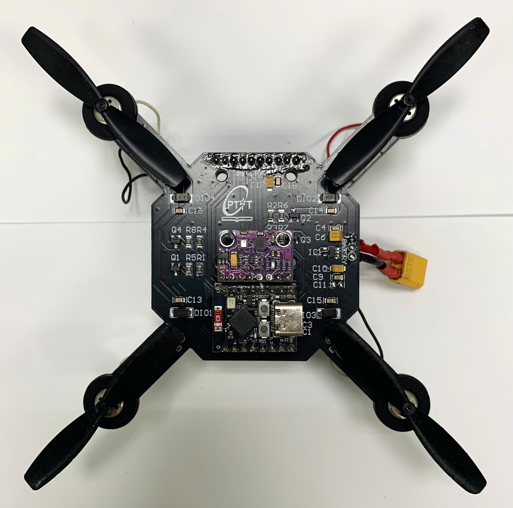
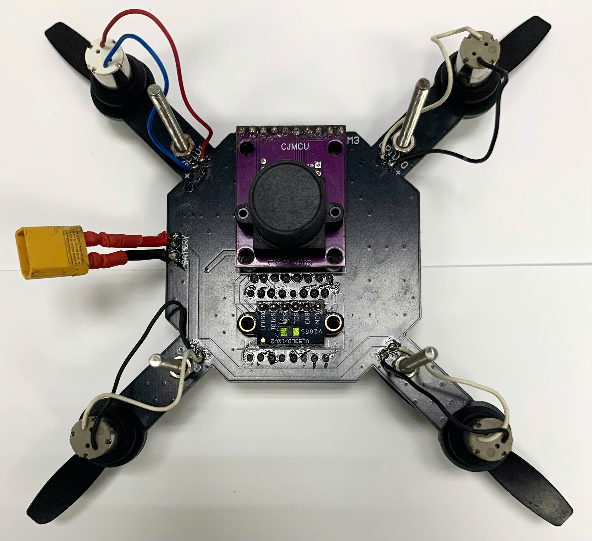
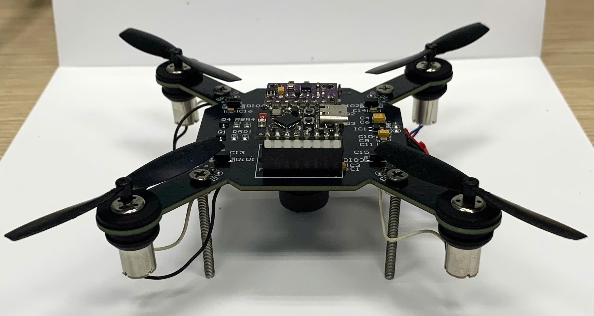

# Mini Drone — Drone Flight

A compact ESP32-C3 flight-control firmware for a four-motor mini drone.

<p align="center">
  
  
  
</p>

## Overview

This branch contains the onboard firmware responsible for reading the IMU, estimating the drone attitude, receiving remote-control commands, running the stabilization controllers, and driving four motors.

The project is built with PlatformIO for the ESP32-C3 using the Arduino framework.

## Main Features

- MPU6500 IMU interface over SPI
- Madgwick attitude estimation
- Cascaded angle and angular-rate PID control
- Four-motor mixing for roll, pitch, and yaw correction
- ESP-NOW command and heartbeat communication
- Arm/disarm handling
- Communication-loss failsafe with gradual throttle reduction
- Modular source layout for communication, control, drivers, estimation, and hardware abstraction

## Hardware

| Component | Description |
|---|---|
| Flight controller | ESP32-C3 development board |
| IMU | MPU6500 accelerometer and gyroscope |
| Motors | Four brushed DC motors |
| Propellers | Four two-blade propellers |
| Frame | Custom mini-drone PCB frame |
| Power | External battery through the onboard power connector |

## Software Architecture

```text
Remote Controller
       |
       | ESP-NOW commands and heartbeat
       v
Communication
       |
       v
Flight-Control Loop
       |
       +--> MPU6500 Driver
       |
       +--> Madgwick Estimator
       |
       +--> Angle PID
       |
       +--> Rate PID
       |
       +--> Motor Mixer
       |
       v
Motor HAL
       |
       v
Four Motors
```

## Project Structure

```text
.
├── docs/                   Documentation and reference material
├── include/                Shared public headers
├── lib/                    Project libraries
├── src/
│   ├── communication/      ESP-NOW communication and protocol
│   ├── control/            PID controller
│   ├── drivers/            MPU6500 driver
│   ├── estimator/          Madgwick attitude estimator
│   ├── hal/                SPI bus and motor abstraction
│   └── main.cpp            Initialization and main flight loop
└── platformio.ini          PlatformIO configuration
```

## Requirements

- Visual Studio Code
- PlatformIO extension or PlatformIO Core
- ESP32-C3 development board
- USB data cable

## Build

Clone the `drone-flight` branch:

```bash
git clone --branch drone-flight --single-branch \
    https://github.com/haikevins/mini-drone.git

cd mini-drone
```

Build the firmware:

```bash
pio run
```

## Upload

Connect the ESP32-C3 and run:

```bash
pio run --target upload
```

The default upload port is configured as:

```text
/dev/ttyACM0
```

Change `upload_port` in `platformio.ini` when the board appears on another port.

## Serial Monitor

```bash
pio device monitor
```

Default monitor speed:

```text
115200 baud
```

## Basic Runtime Flow

```text
setup()
  ├── Initialize MPU6500
  ├── Initialize PID controllers
  ├── Initialize ESP-NOW
  └── Initialize motors

loop()
  ├── Read and filter IMU data
  ├── Update Madgwick attitude estimate
  ├── Check command heartbeat and failsafe state
  ├── Update roll and pitch targets
  ├── Run angle PID controllers
  ├── Run angular-rate PID controllers
  ├── Mix corrections into four motor outputs
  └── Write motor commands
```

## Status

This project is under active development and should be treated as experimental flight-control firmware.
